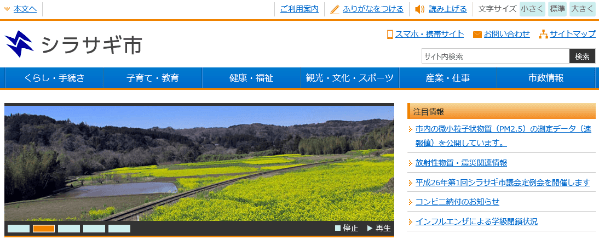

SHIRASAGI Vagrant
===

SHIRASAGI 開発用の Vagrant Box を公開します。

## 使用方法

Vagrant をインストールしていない人は、先に[Vagrant のインストール](#user-content-vagrant-のインストール方法) を参照して、
VirtualBox と Vagrant をインストールしてください。

適当なディレクトリを作成し、次のような内容を持つ `Vagrantfile` を作成してください。

    $ mkdir shirasagi-dev
    $ cd shirasagi-dev
    $ cat Vagrantfile
    VAGRANTFILE_API_VERSION = "2"
    Vagrant.configure(VAGRANTFILE_API_VERSION) do |config|
      config.vm.box = "ss-vagrant-v1.0.2"
      config.vm.box_url = "https://github.com/shirasagi/ss-vagrant/releases/download/v1.0.2/ss-vagrant-virtualbox-x86_64.box"
      config.vm.network :forwarded_port, guest: 3000, host: 3000

      config.vm.provider :virtualbox do |vb|
        # see: http://blog.shibayu36.org/entry/2013/08/12/090545
        # IPv6 と DNS でのネットワーク遅延対策で追記
        vb.customize ["modifyvm", :id, "--natdnsproxy1", "off"]
        vb.customize ["modifyvm", :id, "--natdnshostresolver1", "off"]
      end
    end

次のコマンドで起動できます。

    $ vagrant up

Windows の方は、別途 Git をインストールし git-bash から上記コマンドを実行してください。

`vagrant up` には 5 分から 10 分ぐらいかかるので、コーヒーでも飲みながら待ってください。
もし、`vagrant up` が失敗する場合、次の点を確認して下さい。
  * Intel VT/AMD-V が有効になっている。
  * ユーザ名はアルファベット、数字、ハイフン、アンダーバーのみを含む。
  * [Vagrant が起動しない場合](#user-content-vagrant-が起動しない場合)に詳しく書いています。

起動したら次のコマンドでログインしてください。

    $ vagrant ssh

Windows の方は Tera Term などの SSH クライアントで、
次の接続情報を使用してログインしたほうが快適に使えると思います。

* host: localhost
* port: 2222
* user: vagrant
* password: vagrant

SHIRASAGI は /home/vagrant の直下にインストールしています。

    $ tree -L 2 /home/vagrant
    /home/vagrant
    └── shirasagi
        ├── Gemfile
        ├── Gemfile.lock
        ├── Guardfile
        ├── MIT-LICENSE
        ├── README.md
        ├── Rakefile
        ├── app
        ├── bin
        ├── config
        ├── config.ru
        ├── db
        ├── lib
        ├── log
        ├── private
        ├── public
        ├── spec
        ├── tmp
        └── vendor

SHIRASAGI を起動してみましょう。

```
$ cd $HOME/shirasagi
$ bundle exec rake unicorn:start
bundle exec unicorn_rails -c /home/vagrant/shirasagi/config/unicorn.rb -E production -D
```

ブラウザで "http://localhost:3000/" にアクセスしてみましょう。
次のような画面が表示されれば成功です。

| SHIRASAGI TOP                        |
|--------------------------------------|
|  |

## Vagrant Box の中身

* VirtualBox 5.0.14 r105127 Guest Addition
* CentOS 7.2.1511 (2016-03-02 時点での最新)
* MongoDB 3.0.9
* RVM 1.26.11
* Ruby 2.3.0p0
* SHIRASAGI のソース一式 (v1.0.2)

## Vagrant のインストール方法

1. [VirtualBox Download](https://www.virtualbox.org/wiki/Downloads) ページから VirtualBox をダウンロードしてインストールします。
2. [Vagrant Download](http://www.vagrantup.com/downloads.html) ページから Vagrant をダウンロードしてインストールします。
3. (Windows の人のみ) [Git for Windows](https://msysgit.github.io/) ページから Git をダウンロードしてインストールします。
   これは `vagrant up` 時に ssh コマンドが必要になるためで、Git に付属している ssh を用いるのが一番手っ取り早いのでインストールします。
4. (Windows の人のみ) [Tera Term](http://sourceforge.jp/projects/ttssh2/releases/) などのお好きな SSH クライアントをインストール。

### Vagrant が起動しない場合

* (Mac の人のみ) Intel ベースの Mac では、Intel VT は有効になっていますが、もし使用できない場合は https://support.apple.com/ja-jp/TS2744 を参照してください。
* (Windows の人のみ) お使いのパソコンが Intel VT/AMD-V に対応しているかどうかを確認します。
  [VirtualChecker](http://www.forest.impress.co.jp/library/software/virtualcheck/) をダウンロードし、実行してください。
  Enabled と表示されれば Intel VT/AMD-V が有効になっており、Vagrant を使用することができます。
  Disabled と表示された場合、BIOS の設定を確認し Intel VT/AMD-V を有効にすることで Vagrant を使うことが出来ます。
* (Windows の人のみ) ユーザ名に日本語が含まれる場合、Vagrant が起動しない場合があります。
  環境変数 `VAGRANT_HOME` を日本語を含まないディレクトリに設定し、VirtualBox の設定を変更し、default VM folder を日本語を含まないディレクトリに変更してください。
  参考: [incompatible character encodings: CP850 and Windows-1252](https://github.com/mitchellh/vagrant/issues/3937)
* (Windows の人のみ) 32ビット版 Windows をご利用の方
  * 64ビット CPU で 32ビット版 Windows をご利用の方は、64ビット Vagrant Box をご利用いただけます。
  * 32ビット CPU で 32ビット版 Windows をご利用の方は、すみませんが、以下の方法で、独自に Vagrant Box をビルドしていただくか、
    [SHIRASAGI 開発マニュアル](http://shirasagi.github.io/)の[手動インストール](http://shirasagi.github.io/installation/manual.html)を参考に、
    手動でインストールしてください。

## Vagrant Box のビルド方法

`packer` を別途インストールしてください。そして、次のコマンドでビルドできます。

    $ cd packer
    $ packer build -only=virtualbox-iso template.json

ビルドに成功すると `ss-vagrant-virtualbox-x86_64.box` ができます。
ビルドには 20 分ぐらいかかります。

## 32 ビット版

GitHub には、合計 2GB までしかファイルをアップできないため、32 ビット版の提供を取りやめました。
32 ビット版の Vagrant Box が必要な方は、ご自身でビルドしてください。

`packer` を別途インストールしてください。そして、次のコマンドでビルドできます。

    $ cd packer
    $ packer build -only=virtualbox-iso -var-file=virtualbox-i386-variables.json template.json

以上。
