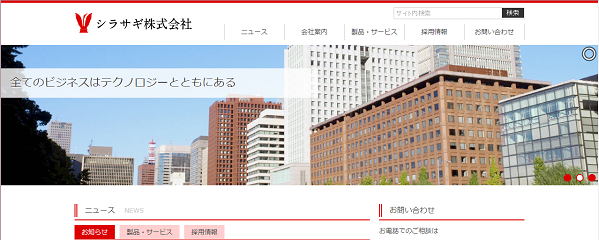
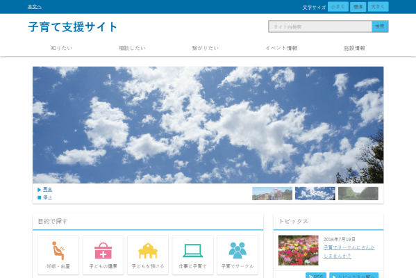
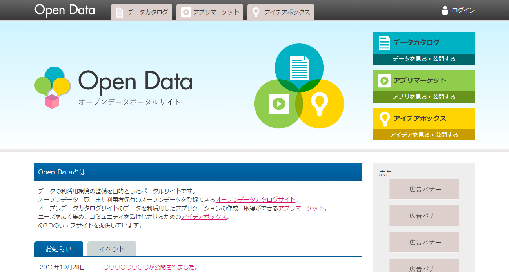
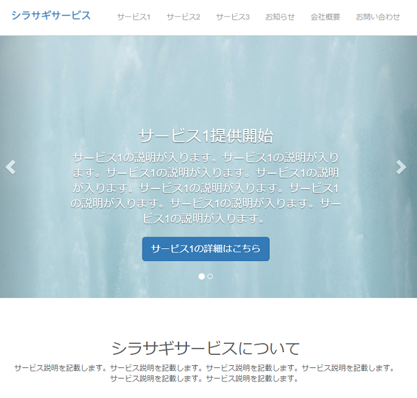
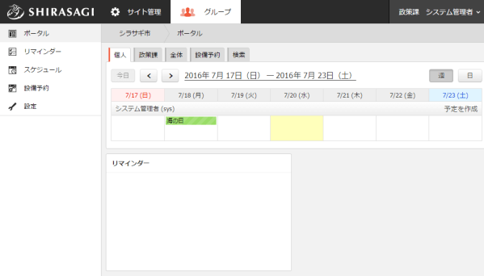

SHIRASAGI Vagrant
===

SHIRASAGI 開発用の Vagrant Box を公開します。

## 事前準備

SHIRASAGI 開発用の Vagrant Box を使用するには次のいずれかの環境が必要です。

* 64ビット Windows
* Mac
* 64ビット Ubuntu / RedHat / CentOS / 他 Linux 全般

事前に VirtualBox と Vagrant をインストールしてください。

* [VirtualBox](https://www.virtualbox.org/):
  * [ダウンロード](https://www.virtualbox.org/wiki/Downloads) から各環境に応じたインストーラーをダウンロードし、インストーラーを実行してください。
  * インストーラー実行後は、インストーラーの指示にしたがってインストールを完了させてください。
* [Vagrant](https://www.vagrantup.com/):
  * [ダウンロード](https://www.vagrantup.com/downloads.html) から各環境に応じたインストーラーをダウンロードし、インストーラーを実行してください。
  * インストーラー実行後は、インストーラーの指示にしたがってインストールを完了させてください。

## 使用方法

### シラサギの起動

適当なディレクトリを作成し、次のような内容を持つ `Vagrantfile` を作成してください。

    $ mkdir shirasagi-dev
    $ cd shirasagi-dev
    $ cat Vagrantfile
    Vagrant.configure(2) do |config|
      config.vm.box = "shirasagi/shirasagi"
      config.vm.box_version = "1.16.1"
      config.vm.network "forwarded_port", guest: 3000, host: 3000
      config.vm.network "private_network", ip: "192.168.56.10"
      config.vm.provider "virtualbox" do |vb|
        vb.memory = "2048"
      end
    end

次のコマンドを実行してください。シラサギ開発環境が起動します。

    $ vagrant up

`vagrant up` コマンドは 10 分から 20 分ぐらいかかるので、コーヒーでも飲みながら待ってください。
`vagrant up` コマンドが失敗した場合、<a href="#vagrant-%E3%81%8C%E8%B5%B7%E5%8B%95%E3%81%97%E3%81%AA%E3%81%84%E5%A0%B4%E5%90%88">Vagrant が起動しない場合</a>を参考にして問題を解決してください。

### hosts ファイルの設定

待っている間に、シラサギを使用するには hosts ファイルの設定が必要なため、ここからは hosts ファイルを設定していきます。
hosts ファイルはメモ帳から開くことができます。
その際メモ帳は管理者権限で開いてください。

Windows の hosts ファイルは以下にあります。

* Windows の hosts ファイル

      C:\Windows\System32\drivers\etc\hosts

Mac の hosts ファイルは以下にあります。
編集には root 権限が必要です。

* Mac の hosts ファイル

      /etc/hosts

hosts ファイルが開けましたら以下の一行を入力してください。

  127.0.0.1 company.example.jp childcare.example.jp opendata.example.jp lp.example.jp

### シラサギへアクセス

起動したら次のコマンドを実行すると、シラサギ開発環境にログインすることができます。

    $ vagrant ssh

Windows の方は [Tera Term](https://osdn.jp/projects/ttssh2/) などの SSH クライアントをインストールし、
次の接続情報を使用してログインしてください。

* host: 192.168.56.10
* port: 22
* user: vagrant
* password: vagrant

次のようなプロンプトが表示されれば、シラサギ開発環境へのログインに成功しています。この画面では、コマンドの入力を待ち受けます。

    vagrant@ubuntu-focal:~$

`tree -L 2 /var/www` というコマンドを実行し、SHIRASAGI がインストールされていることを確認してみましょう。

    vagrant@ubuntu-focal:~$ tree -L 2 .
    .
    └── shirasagi
        ├── Gemfile
        ├── Gemfile.lock
        ├── Guardfile
        ├── MIT-LICENSE
        ├── README.md
        ├── Rakefile
        ├── app
        ├── bin
        ├── config
        ├── config.ru
        ├── db
        ├── lib
        ├── log
        ├── private
        ├── public
        ├── spec
        ├── tmp
        └── vendor

SHIRASAGI がインストールされていることを確認できたので、SHIRASAGI を起動してみましょう。

```sh
$ cd $HOME/shirasagi
$ bundle exec rake unicorn:start
bundle exec unicorn_rails -c /var/www/shirasagi/config/unicorn.rb -E production -D
```

### 自治体サンプルサイト

ブラウザで "http://localhost:3000/" にアクセスしてみましょう。
次のような自治体サンプルサイトの画面が表示されれば成功です。

| 自治体サンプル                        |
|---------------------------------------|
|  |

### 企業サンプルサイト

ブラウザで "http://company.example.jp:3000/" にアクセスしてみてください。
次のような企業サンプルサイトの画面が表示されるはずです。

| 企業サンプル                             |
|------------------------------------------|
|   |

### 子育て支援サンプルサイト

ブラウザで "http://childcare.example.jp:3000/" にアクセスしてみてください。
次のような子育て支援サンプルサイトの画面が表示されるはずです。

| 子育て支援サンプル                              |
|-------------------------------------------------|
|  |

### オープンデータサンプルサイト

ブラウザで "http://opendata.example.jp:3000/" にアクセスしてみてください。
次のようなオープンデータサンプルサイトの画面が表示されるはずです。

| オープンデータ                                  |
|-------------------------------------------------|
|  |

### LPサンプルサイト

ブラウザで "http://lp.example.jp:3000/" にアクセスしてみてください。
次のようなLPサンプルサイトの画面が表示されるはずです。

| LPサンプル                                  |
|-------------------------------------------------|
|  |

### グループウェア

ブラウザで "http://localhost:3000/.g1" にアクセスし、sys / pass でログインしてみてください。
次のようなグループウェアの画面が表示されるはずです。

| グループウェア                         |
|----------------------------------------|
|   |

### 管理画面

管理画面には http://localhost:3000/.mypage からアクセスできます。
次のユーザーでログインできます。

種類           | ユーザーID | メールアドレス   | パスワード
---------------|------------|------------------|-----------
システム管理者 | sys        | sys@example.jp   | pass
サイト管理者   | admin      | admin@example.jp | pass
一般ユーザー   | user1      | user1@example.jp | pass
一般ユーザー   | user2      | user2@example.jp | pass
一般ユーザー   | user3      | user3@example.jp | pass

以上で正しくシラサギ開発環境が起動しました。
バリバリとシラサギをいじっていきましょう。

## Vagrant が起動しない場合

### Windows

* お使いのパソコンが Intel VT/AMD-V に対応しているかどうかを確認します。
  [VirtualChecker](http://www.forest.impress.co.jp/library/software/virtualcheck/) をダウンロードし、実行してください。
  Enabled と表示されれば Intel VT/AMD-V が有効になっており、Vagrant を使用することができます。
  Disabled と表示された場合、BIOS の設定を確認し Intel VT/AMD-V を有効にすることで Vagrant を使うことが出来ます。
* Hyper-V とは同居できません。Hyper-V を無効にするか、アンインストールしてください。
* ユーザ名に日本語が含まれる場合、Vagrant が起動しない場合があります。
  環境変数 `VAGRANT_HOME` を日本語を含まないディレクトリに設定し、VirtualBox の設定を変更し、default VM folder を日本語を含まないディレクトリに変更してください。
  参考: [incompatible character encodings: CP850 and Windows-1252](https://github.com/mitchellh/vagrant/issues/3937)
* Windows 10 をご利用の方で、次のエラーが表示される場合、Microsoft 社より Visual C++ 2010 再配布可能パッケージをダウンロードしインストールしてください。

  ```
  An error occurred while downloading the remote file.
  The error message, if any, is reproduced below.
  Please fix this error and try again.
  ```

  * [Microsoft Visual C++ 2010 再頒布可能パッケージ (x86)](https://www.microsoft.com/ja-jp/download/details.aspx?id=5555)
  * [Microsoft Visual C++ 2010 再頒布可能パッケージ (x64)](https://www.microsoft.com/ja-jp/download/details.aspx?id=14632)
  * 上記 2 つともインストールしてください。

* 次のように "Authentication failure" が繰り返し表示される場合、Vagrant を一つ前のバージョンに戻してみてください。

  ```
  > vagrant up default
  ========= 省略 =========
  ==> default: Booting VM...
  ==> default: Waiting for machine to boot. This may take a few minutes...
      default: SSH address: 127.0.0.1:2222
      default: SSH username: vagrant
      default: SSH auth method: private key
      default: Warning: Connection timeout. Retrying...
      default: Warning: Authentication failure. Retrying...
      default: Warning: Authentication failure. Retrying...
  ```

* 次のように Connection timeout が繰り返し表示される場合、[VirtualBox の設定の確認方法](virtual-box-settings.md) を参照し VirtualBox の設定を確認してみてください。

  ```
  > vagrant up default
  ========= 省略 =========
  ==> default: Booting VM...
  ==> default: Waiting for machine to boot. This may take a few minutes...
      default: SSH address: 127.0.0.1:2222
      default: SSH username: vagrant
      default: SSH auth method: private key
      default: Warning: Connection timeout. Retrying...
      default: Warning: Connection timeout. Retrying...
      default: Warning: Connection timeout. Retrying...
  ```

* 次のように Failed to attach the network LUN (VERR_INTNET_FLT_IF_NOT_FOUND) が表示される場合、[VirtualBox で Failed to open/create the internal network 'HostInterfaceNetworking-VirtualBox Host-Only Ethernet Adapter' が出た時の対処](https://qiita.com/ExA_DEV/items/ae80a7d767144c2e1992)を参照し、ネットワークアダプターの設定を確認してみてください。

  ```
  Stderr: VBoxManage.exe: error: Failed to open/create the internal network 'HostInterfaceNetworking-VirtualBox Host-Only Ethernet Adapter #2' (VERR_INTNET_FLT_IF_NOT_FOUND).
  VBoxManage.exe: error: Failed to attach the network LUN (VERR_INTNET_FLT_IF_NOT_FOUND)
  VBoxManage.exe: error: Details: code E_FAIL (0x80004005), component ConsoleWrap, interface IConsole
  ```

* 次のように Appliance import failed が表示される場合、ディスクの空き容量が十分にあるかどうかを確認してみてください。それでも解決しないようなら [Vagrant: 自分のミスで仮想マシン作成に失敗していた](http://sutara79.hatenablog.com/entry/2015/06/28/104150)を参照し、VirtualBox のデフォルトの仮想マシンフォルダーが存在しているかどうかを確認してみてください。

  ```
  Progress state: VBOX_E_IPRT_ERROR
  VBoxManage.exe: error: Appliance import failed
  ```

以上で問題が解決しない方は[シラサギプロジェクト開発コミュニティ](https://www.facebook.com/groups/ssproj/)で質問してください。

### Mac

* Intel ベースの Mac では、Intel VT は有効になっていますが、もし使用できない場合は https://support.apple.com/ja-jp/TS2744 を参照してください。
* 次のように "Authentication failure" が繰り返し表示される場合、Vagrant を一つ前のバージョンに戻してみてください。

  ```
  > vagrant up default
  ========= 省略 =========
  ==> default: Booting VM...
  ==> default: Waiting for machine to boot. This may take a few minutes...
      default: SSH address: 127.0.0.1:2222
      default: SSH username: vagrant
      default: SSH auth method: private key
      default: Warning: Connection timeout. Retrying...
      default: Warning: Authentication failure. Retrying...
      default: Warning: Authentication failure. Retrying...
  ```

* 他にもうまくいかない場合、Vagrant を一つ前のバージョンに戻してみてください。

以上で問題が解決しない方は[シラサギプロジェクト開発コミュニティ](https://www.facebook.com/groups/ssproj/)で質問してください。

## Vagrant Box 詳細

### Vagrant Box の中身

* Ubuntu Focal (2022-08-17 時点での最新)
* MongoDB 4.4.15
* RVM 1.29.12-next
* Ruby 3.0.4p208
* SHIRASAGI のソース一式 (v1.16.1)

### Vagrant Box のビルド方法

ローカルの環境に ansible をインストールしてください。そして、次のコマンドでビルドできます。

    $ git clone "https://github.com/shirasagi/ss-vagrant.git"
    $ cd ss-vagrant/build
    $ vagrant up && vagrant package

ビルドに成功すると `package.box` ができます。
ビルドには 30 分ぐらいかかります。

## Windows の共有フォルダーを使った開発方法

Windows 版 Vagrant Box の共有ファイルは非常に遅く、Windows の共有フォルダーを使った方が、
早くて快適にシラサギの開発をすすめることが出来ます。

次にその手順を解説します。

なお、Mac 版 Vagrant Box の共有ファイルは遅くはないので、そのままご利用ください。

### Windows の共有フォルダーの利用方法

次のコマンドを Vagrant Box 内で実行し CIFS をインストールします。
CIFS とは、Linux 上で Windows の共有フォルダーを使用するためのツールです。

    $ yum -y install cifs-utils

Windows 側でシラサギの開発ディレクトリを `www` という名前で共有します。
次のコマンドを実行し、Windows の共有フォルダー `www` を `/var/www` にマウントします。

    $ sudo mkdir -p /var/www
    $ sudo mount -t cifs -o user=vagrant //10.0.2.2/www /var/www

`/var/www` の中身を表示してみると、Windows 側と同じファイルが見えるようになります。

    $ tree -L 2 /var/www

### Windows の共有フォルダーを起動時に自動でマウントさせる設定

Vagrant Box 内の `/etc/fstab` ファイルに次の行を追加します。


    //10.0.2.2/www /var/www cifs user=vagrant,password=****,dir_mode=0777,file_mode=0666 0 0

以上。
