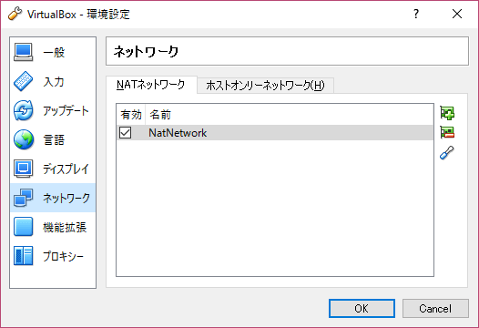
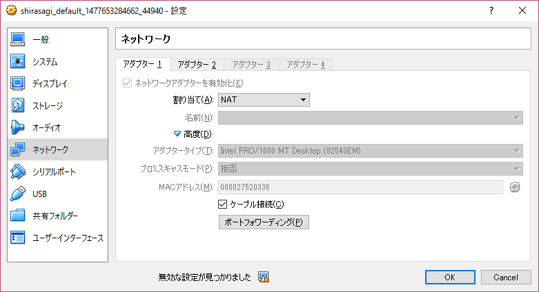

VirtualBox の設定の確認方法
===

### NAT ネットワークの確認

NAT ネットワークが適切に作成されているかを確認します。
手順は:

1. VirtualBox アプリケーションを起動
2. メニューの [ファイル] -> [環境設定] をクリック
3. 左側の一覧から [ネットワーク] を選択
4. 右側の一覧に "NatNetwork" があることを確認
  

### 仮想マシンのネットワークの確認

仮想マシンのネットワークが適切に作成されているかを確認します。

1. VirtualBox アプリケーションを起動
2. 左側の一覧から仮想マシンを選択し、上部ツールバーの [設定] をクリック
3. 左側の一覧から [ネットワーク] を選択
4. 右側の [高度] をクリックし、詳細な情報を表示
5. [ケーブル接続] にチェックが入っていることを確認
  
